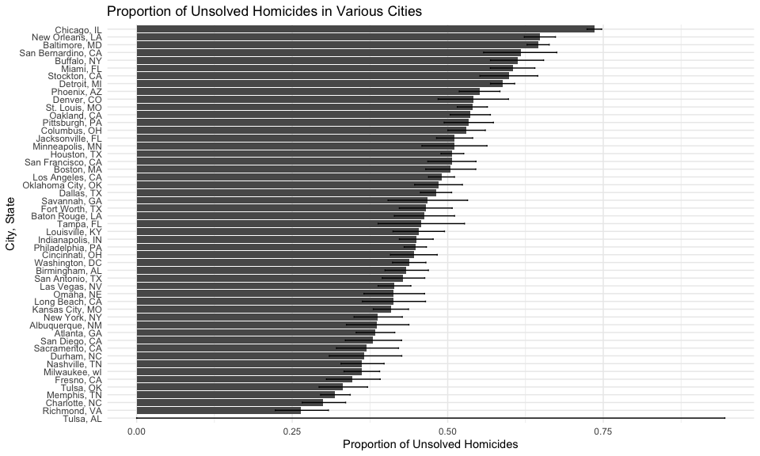
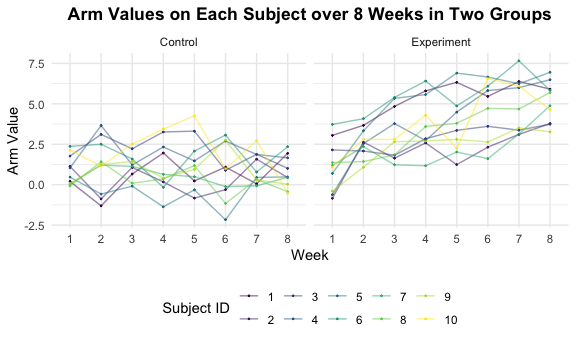
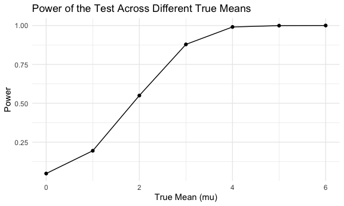
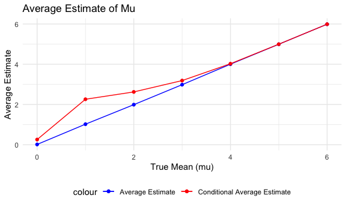

Homework 5
================
Yiying Wu

## 1

Read data

``` r
urlfile = "https://raw.githubusercontent.com/washingtonpost/data-homicides/master/homicide-data.csv"

homicide_data <- read_csv(url(urlfile))|>
                  janitor::clean_names()
```

Prepare data

``` r
homicide_summary=homicide_data|>
  unite("city_state", city, state, sep = ", ") |>
  group_by(city_state) |>
  summarize(
    Total_Homicides = n(),
    Unsolved_Homicides = sum(disposition %in% c("Closed without arrest", "Open/No arrest")))
```

Proportion test for Baltimore, MD

``` r
baltimore_data <- filter(homicide_summary, city_state == "Baltimore, MD")
baltimore_test <- prop.test(baltimore_data$Unsolved_Homicides, baltimore_data$Total_Homicides)
baltimore_test |> broom::tidy()
```

    ## # A tibble: 1 × 8
    ##   estimate statistic  p.value parameter conf.low conf.high method    alternative
    ##      <dbl>     <dbl>    <dbl>     <int>    <dbl>     <dbl> <chr>     <chr>      
    ## 1    0.646      239. 6.46e-54         1    0.628     0.663 1-sample… two.sided

Proportion test for all cities

``` r
all_cities_test <- homicide_summary %>%
  mutate(
    test_result = map2(Unsolved_Homicides, Total_Homicides, ~prop.test(.x, .y)),
    tidy_result = map(test_result, broom::tidy),  # Specify broom::tidy directly
    city_state = city_state  # Preserve city_state in the final result
  ) %>%
  select(-test_result) %>%  # Remove the test_result column
  unnest(tidy_result)

all_cities_test=all_cities_test|>select(city_state, estimate, conf.low, conf.high)
all_cities_test
```

    ## # A tibble: 51 × 4
    ##    city_state      estimate conf.low conf.high
    ##    <chr>              <dbl>    <dbl>     <dbl>
    ##  1 Albuquerque, NM    0.386    0.337     0.438
    ##  2 Atlanta, GA        0.383    0.353     0.415
    ##  3 Baltimore, MD      0.646    0.628     0.663
    ##  4 Baton Rouge, LA    0.462    0.414     0.511
    ##  5 Birmingham, AL     0.434    0.399     0.469
    ##  6 Boston, MA         0.505    0.465     0.545
    ##  7 Buffalo, NY        0.612    0.569     0.654
    ##  8 Charlotte, NC      0.300    0.266     0.336
    ##  9 Chicago, IL        0.736    0.724     0.747
    ## 10 Cincinnati, OH     0.445    0.408     0.483
    ## # ℹ 41 more rows

Create a plot that shows the estimates and CIs for each city

``` r
ggplot(all_cities_test, aes(x=reorder(city_state, estimate), y=estimate)) +
  geom_bar(stat="identity") +
  geom_errorbar(aes(ymin=conf.low, ymax=conf.high), width=.2) +
  coord_flip() +
  xlab("City, State") +
  ylab("Proportion of Unsolved Homicides") +
  ggtitle("Proportion of Unsolved Homicides in Various Cities")
```



## 2

import data

``` r
data_files = tibble(list.files("./data")) |>
  mutate(file_list = paste(list.files("./data")))
```

Creating functions to read multiple datasets in the list

``` r
read_files = function(x) {
  
    data = read_csv(paste0("./data/", x))|>
      mutate(file_names = x)
}

arm_dataset = map_df(data_files$file_list, read_files)

arm_dataset
```

    ## # A tibble: 20 × 9
    ##    week_1 week_2 week_3 week_4 week_5 week_6 week_7 week_8 file_names
    ##     <dbl>  <dbl>  <dbl>  <dbl>  <dbl>  <dbl>  <dbl>  <dbl> <chr>     
    ##  1   0.2   -1.31   0.66   1.96   0.23   1.09   0.05   1.94 con_01.csv
    ##  2   1.13  -0.88   1.07   0.17  -0.83  -0.31   1.58   0.44 con_02.csv
    ##  3   1.77   3.11   2.22   3.26   3.31   0.89   1.88   1.01 con_03.csv
    ##  4   1.04   3.66   1.22   2.33   1.47   2.7    1.87   1.66 con_04.csv
    ##  5   0.47  -0.58  -0.09  -1.37  -0.32  -2.17   0.45   0.48 con_05.csv
    ##  6   2.37   2.5    1.59  -0.16   2.08   3.07   0.78   2.35 con_06.csv
    ##  7   0.03   1.21   1.13   0.64   0.49  -0.12  -0.07   0.46 con_07.csv
    ##  8  -0.08   1.42   0.09   0.36   1.18  -1.16   0.33  -0.44 con_08.csv
    ##  9   0.08   1.24   1.44   0.41   0.95   2.75   0.3    0.03 con_09.csv
    ## 10   2.14   1.15   2.52   3.44   4.26   0.97   2.73  -0.53 con_10.csv
    ## 11   3.05   3.67   4.84   5.8    6.33   5.46   6.38   5.91 exp_01.csv
    ## 12  -0.84   2.63   1.64   2.58   1.24   2.32   3.11   3.78 exp_02.csv
    ## 13   2.15   2.08   1.82   2.84   3.36   3.61   3.37   3.74 exp_03.csv
    ## 14  -0.62   2.54   3.78   2.73   4.49   5.82   6      6.49 exp_04.csv
    ## 15   0.7    3.33   5.34   5.57   6.9    6.66   6.24   6.95 exp_05.csv
    ## 16   3.73   4.08   5.4    6.41   4.87   6.09   7.66   5.83 exp_06.csv
    ## 17   1.18   2.35   1.23   1.17   2.02   1.61   3.13   4.88 exp_07.csv
    ## 18   1.37   1.43   1.84   3.6    3.8    4.72   4.68   5.7  exp_08.csv
    ## 19  -0.4    1.08   2.66   2.7    2.8    2.64   3.51   3.27 exp_09.csv
    ## 20   1.09   2.8    2.8    4.3    2.25   6.57   6.09   4.64 exp_10.csv

Tidy the dataset

``` r
clean_arm_dataset =
  arm_dataset |>
  janitor::clean_names() |>
  gather(key = week, value = arm_value, week_1:week_8) |>
  mutate(week = str_remove(week, "week_")) |>
  mutate(subject_ID = as.integer(str_extract(file_names, "[0-9][0-9]"))) |>
  mutate(file_names = ifelse(str_detect(file_names, "con") == TRUE,
                             "Control", "Experiment")) |>
  mutate(across(.cols = c(file_names, week, subject_ID), as.factor)) |>
  relocate(file_names, subject_ID, arm_value)

clean_arm_dataset
```

    ## # A tibble: 160 × 4
    ##    file_names subject_ID arm_value week 
    ##    <fct>      <fct>          <dbl> <fct>
    ##  1 Control    1               0.2  1    
    ##  2 Control    2               1.13 1    
    ##  3 Control    3               1.77 1    
    ##  4 Control    4               1.04 1    
    ##  5 Control    5               0.47 1    
    ##  6 Control    6               2.37 1    
    ##  7 Control    7               0.03 1    
    ##  8 Control    8              -0.08 1    
    ##  9 Control    9               0.08 1    
    ## 10 Control    10              2.14 1    
    ## # ℹ 150 more rows

spaghetti plot showing observations on each subject over time

``` r
clean_arm_dataset |>
  ggplot(aes(week, arm_value, color=subject_ID)) + 
  geom_point(size = 0.2) + 
  geom_line(aes(group = subject_ID), alpha=0.5) +
  facet_grid(~file_names) +
  labs(x = "Week", y = "Arm Value", 
       title = "Arm Values on Each Subject over 8 Weeks in Two Groups",
       col = "Subject ID") +
  theme(plot.title = element_text(hjust = 0.5, face = "bold"))
```



In the experimental group, subjects generally experienced an increase in
arm measurements over the 8-week period, although the timing and extent
of these changes varied among individuals. Conversely, in the control
group, subjects’ arm measurements fluctuated over time without any clear
trend or significant alterations, in contrast to those in the
experimental group. Notably, no individuals in the control group
achieved arm measurements exceeding 5, whereas approximately half of the
participants in the experimental group surpassed this value during the
study.

## 3

Generate 5000 datasets from the model $$x\sim Normal[\mu,\sigma]$$

``` r
set.seed(8105) # For reproducibility
n = 30 # Sample size
sigma = 5 # Standard deviation
mu_values = 0:6 # True mean values
alpha = 0.05 # Significance level
num_simulations = 5000 # Number of simulations

simulation_results = map_dfr(mu_values, function(mu) {
  tibble(
    mu = mu,
    simulation = map(1:num_simulations, ~ t.test(rnorm(n, mu, sigma))),
    estimate = map_dbl(simulation, ~ broom::tidy(.x)$estimate),
    p_value = map_dbl(simulation, ~ broom::tidy(.x)$p.value),
    reject_null = p_value < alpha
  )
})
```

Plot: Proportion of times the null is rejected (power of the test)

``` r
# create power_results dataset
power_results <- simulation_results |>
  group_by(mu) |>
  summarise(power = mean(reject_null), 
            avg_mu_hat = mean(estimate), 
            avg_mu_hat_rejected = mean(estimate[reject_null]))

#plotting
power_plot = power_results |>
  ggplot(aes(x = mu, y = power)) +
  geom_point() +
  geom_line() +
  labs(title = "Power vs. True Mean", x = "True Mean (mu)", y = "Power")

power_plot
```



There’s a positive relationship between effect size and power, with
diminishing returns as the effect size becomes large. As the true mean
$\mu$ increases away from 0, the power of the test also increases. The
power increases rapidly as $\mu$ moves from 0 to 2, showing a steep
curve. The rate of increase in power slows down as $\mu$ becomes larger
(around 4 and above). This relationship is consistent with statistical
theory: larger effect sizes make it easier to detect a true effect, thus
increasing the power of the test.

Plot: Average estimate of mu

``` r
estimate_plot <- power_results |>
  ggplot(aes(x = mu)) +
  geom_point(aes(y = avg_mu_hat, color = "Average Estimate"), shape = 1) +  
  geom_line(aes(y = avg_mu_hat, color = "Average Estimate")) +
  geom_point(aes(y = avg_mu_hat_rejected, color = "Conditional Average Estimate"), shape = 2) +
  geom_line(aes(y = avg_mu_hat_rejected, color = "Conditional Average Estimate"), linetype = "dashed") +
  labs(
    title = "Average Estimated Mean vs. True Mean",
    x = "True Mean (mu)",
    y = "Average Estimated Mean",
    color = "mu_hat"
  ) +
  scale_color_manual(
    values = c("Average Estimate" = "blue", "Conditional Average Estimate" = "red")
  ) +
  theme_minimal() +
  theme(legend.position = "bottom")

estimate_plot
```



the sample average of $\hat{\mu}$ across tests for which the null is
rejected is not approximately equal to the true value of $\mu$,
particularly for smaller true mean values. This is because the rejection
of the null hypothesis is partially driven by the magnitude of
$\hat{\mu}$, leading to an overestimate of the true mean when the null
is rejected. As the true mean increases, the conditional estimates
approach the line $\hat\mu=\mu$, since larger true means are easier to
detect and less subject to the extremes of sampling variability.
